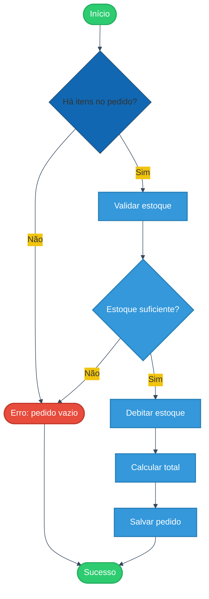

# OrderService.cs - Documentação

## Fluxo de criação de pedidos (Mermaid)

```mermaid
%%{init: {'theme':'base', 'themeVariables': {'primaryColor':'#1167b1', 'secondaryColor':'#f1c40f', 'tertiaryColor':'#2ecc71', 'lineColor':'#34495e', 'textColor':'#2c3e50'}}}%%
graph TD
    A([Início]) --> B{Há itens no pedido?}
    B -- Não --> Z([Erro: pedido vazio])
    B -- Sim --> C[Validar estoque]
    C --> D{Estoque suficiente?}
    D -- Não --> Z
    D -- Sim --> E[Debitar estoque]
    E --> F[Calcular total]
    F --> G[Salvar pedido]
    G --> H([Sucesso])
    Z --> H

    classDef success fill:#2ecc71,stroke:#27ae60,stroke-width:2px,color:#ffffff;
    classDef error fill:#e74c3c,stroke:#c0392b,stroke-width:2px,color:#ffffff;
    classDef neutral fill:#3498db,stroke:#2980b9,stroke-width:2px,color:#ffffff;

    class A,H success;
    class Z error;
    class C,D,E,F,G neutral;
```
