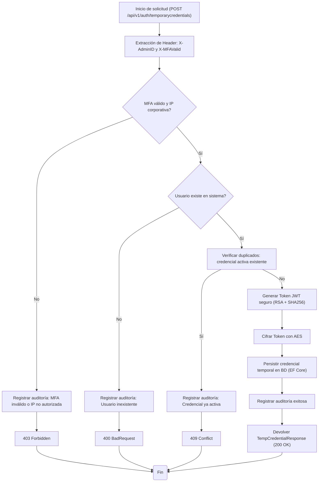
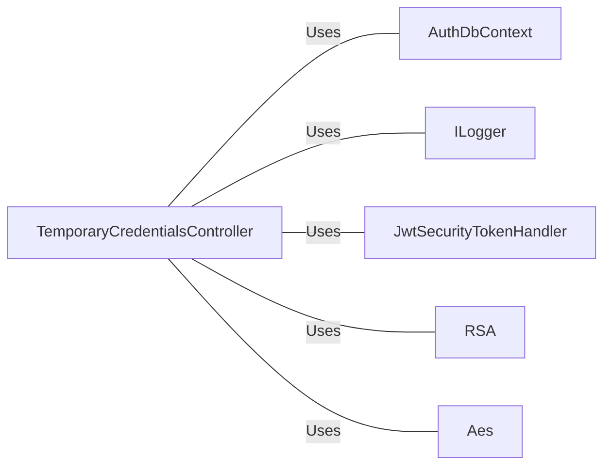

# TemporaryCredentials.cs: Generación Segura de Credenciales Temporales

## Overview
Este controlador, **TemporaryCredentialsController**, gestiona la creación de credenciales temporales para usuarios mediante validaciones de seguridad (MFA e IP corporativa), generación de tokens JWT cifrados con AES y registro de auditoría.  
Integra mecanismos de seguridad y persistencia utilizando **Entity Framework**, **JWT** y **cifrado RSA/AES**.

## Process Flow

## Insights
- El proceso está fuertemente asegurado: **RSA** se usa para firmar el JWT y **AES** para cifrarlo antes de persistirlo.
- Las validaciones de seguridad adicionales (MFA e IP corporativa) previenen accesos no autorizados.
- Se implementa trazabilidad completa mediante registros de auditoría (`LogAudit`) en todas las ramas críticas.
- La verificación de duplicados evita conflictos con credenciales activas para el mismo usuario.
- El flujo de errores es granular, devolviendo códigos HTTP adecuados (`403`, `400`, `409`, `500`).
- El modelo `TemporaryCredential` persiste la información esencial del token cifrado y su estado.

## Dependencies

- `AuthDbContext`: Acceso y manipulación de la tabla `TemporaryCredentials`.
- `ILogger<TemporaryCredentialsController>`: Registro de acciones y auditoría.
- `JwtSecurityTokenHandler`: Creación y codificación del token JWT firmado con RSA.
- `RSA`: Firma digital del token.
- `Aes`: Cifrado simétrico del token antes de su persistencia.

## Data Manipulation (SQL)
### Tabla `TemporaryCredential`
| Campo           | Tipo          | Descripción                                      |
|-----------------|----------------|--------------------------------------------------|
| Id              | `string`       | Identificador único (GUID).                     |
| UserId          | `string`       | ID del usuario propietario de la credencial.    |
| AdminId         | `string`       | ID del admin que generó la credencial.          |
| TokenEncrypted  | `string`       | Token JWT cifrado mediante AES.                 |
| ExpiresAt       | `DateTime`     | Fecha/hora de expiración del token.             |
| Status          | `CredentialStatus` | Estado actual: `Active`, `Revoked`, `Expired`. |
| CreatedAt       | `DateTime`     | Fecha/hora de creación.                         |

### Entidad `CredentialStatus`
| Valor     | Descripción                       |
|------------|-----------------------------------|
| Active     | Credencial activa y vigente.      |
| Revoked    | Credencial anulada.               |
| Expired    | Credencial caducada.              |
